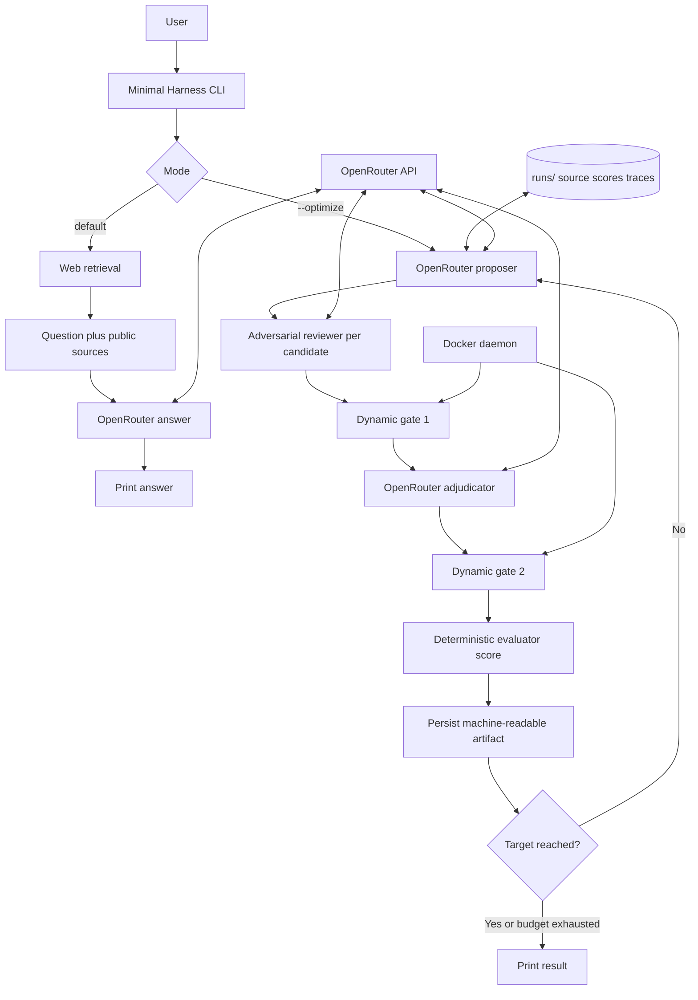

# Minimal Harness

A modified Meta-Harness where agents propose, test, challenge, and adjudicate coding harnesses for iterative improvement.

Minimal Harness is a Python control plane inspired by **Meta-Harness: End-to-End Optimization of Model Harnesses** ([arXiv:2603.28052v1](https://arxiv.org/html/2603.28052v1)). It combines a direct research-answer mode with a modified candidate-search loop.

This repository is an independent modification. It is not the paper authors' artifact and does not reproduce their benchmark numbers.

## What The Paper Says

The paper describes a system that “repeatedly proposes, evaluates, and logs new harnesses.” Its central engineering decision is to let an agent inspect a filesystem containing prior candidate source code, evaluation scores, and raw execution traces.

The paper also says the proposer is a coding agent that can invoke developer tools and modify code, and that the proposer should selectively retrieve history rather than receive a lossy summary. Its practical tips emphasize a good skill, a difficult search set, queryable machine-readable logs, lightweight validation before expensive evaluations, and an evaluator outside the proposer.

The paper's search loop is approximately:

```text
initial valid harnesses
  -> evaluate candidates
  -> store source, scores, and traces
  -> proposer inspects filesystem history
  -> proposer writes a new harness
  -> external evaluator scores it
  -> log artifacts
  -> repeat for fixed N iterations
  -> evaluate Pareto frontier on held-out data
```

## What We Modified

Minimal Harness keeps the paper's proposer, external-evaluation, artifact-history, and repeated-search ideas, then adds explicit policy stages requested for this project:

```text
proposer candidate
  -> adversarial reviewer for that candidate
  -> dynamic test gate 1
  -> adjudicator
  -> dynamic test gate 2
  -> verified winner or another cycle
```

The paper does **not** specify adversarial reviewers, Docker gates, an adjudicator, or a universal 100% stopping rule. Those are our extensions.

| Concern | Paper | Minimal Harness |
| --- | --- | --- |
| Proposal | Coding-agent proposer | OpenRouter proposer |
| History | Full filesystem access | `runs/` JSON artifacts |
| Evaluation | External evaluator | Docker gate abstraction |
| Review | Not a defined stage | One adversarial review per candidate |
| Adjudication | Population/Pareto frontier | Adjudicator selects a survivor |
| Stopping | Fixed iteration budget | Target score or iteration budget |
| Final evaluation | Held-out test set | Domain evaluator still required |

## Architecture



## Two Modes

### Answer Mode

The default command runs the bounded agent tool loop and prints a direct answer. The model can request `web_search` when public sources are useful.

```bash
python3 -m meta_harness.cli "Who is Kevin Thomas of Reverse Engineering mytechnotalent?"
```

Expected progress output:

```text
Searching web...
Asking OpenRouter...
<answer>
```

Useful examples:

```bash
python3 -m meta_harness.cli "What does the Meta-Harness paper contribute?"
python3 -m meta_harness.cli "How does Docker help evaluate coding agents?"
python3 -m meta_harness.cli --no-web "Explain this repository's architecture"
```

The default mode also supports the file, terminal, web, browser, and evaluator tools when the model requests them.

### Interactive Tool Loop

The default runtime now includes a bounded Pi-like tool loop. OpenRouter can request these tools and receive their results before producing its final response:

- `read`: read a file inside the workspace.
- `write`: create or replace a file inside the workspace.
- `edit`: replace exactly one matching text fragment.
- `bash`: run a shell command from the workspace with a timeout.
- `web_search`: retrieve public search results and GitHub profile fallback data.
- `browser_open`: inspect a page title, URL, and visible text with Playwright.
- `browser_screenshot`: capture a full-page PNG with Playwright.

File paths are confined to the workspace root. This loop supports real website generation, local commands, web retrieval, browser inspection, screenshots, JSONL sessions, steering, follow-ups, context compaction, and a full-screen curses TUI.

The live tool loop has been tested with OpenRouter prompts that caused the agent to create files, run bash verification, invoke `web_search`, and create a website.

Run an interactive session with a persistent JSONL transcript:

```bash
python3 -m meta_harness.cli --interactive --session runs/session.jsonl "Inspect this workspace"
```

Enter prompts at `you>`. Type `/quit` to exit. The transcript stores user, assistant, and tool-result messages.

Launch the full-screen terminal interface:

```bash
python3 -m meta_harness.cli --tui --session runs/tui-session.jsonl "Inspect this workspace"
```

Type prompts in the bottom editor. Press Enter to submit, Backspace to edit, and Ctrl-C or Ctrl-D to exit.

Use an isolated workspace for application generation:

```bash
mkdir -p e2e-workspaces/new-site
python3 -m meta_harness.cli --workspace e2e-workspaces/new-site "Build a complete responsive website here. Create index.html, styles.css, and app.js, then use bash to verify them."
```

### Optimize Mode

The original modified search loop is explicit with `--optimize`:

```bash
python3 -m meta_harness.cli --optimize "Improve the seed harness"
```

Examples:

```bash
python3 -m meta_harness.cli --optimize --iterations 3 "Improve retrieval quality"
python3 -m meta_harness.cli --optimize --iterations 1 --no-web "Test the proposer wiring"
python3 -m meta_harness.cli --optimize --no-docker --no-web "Run an offline wiring check"
```

The interactive tool loop also accepts `--max-turns N` (default `24`) and `--workspace PATH` (default `.`). Provider model discovery is available with `--list-models` and `--free-only`.

Discover current OpenRouter models without a seed prompt:

```bash
python3 -m meta_harness.cli --list-models --free-only
```

The optimizer currently produces proposal artifacts and is separate from the interactive coding loop. The tool loop can create files and run commands. The optimizer's Docker gate now includes stronger container restrictions, but its task score remains a placeholder unless you replace the command with a domain evaluator.

The interactive agent can invoke `evaluate_app` for deterministic checks of `index.html`, `styles.css`, `app.js`, HTML structure, and Node JavaScript syntax. It can invoke `browser_assert` to require visible page text before accepting a browser check.

## OpenRouter Setup

1. Create an API key at <https://openrouter.ai/settings/keys>.
2. Create `.env` in the repository root.
3. Never commit `.env` or place a real key in `.env.example`.

```dotenv
OPENROUTER_API_KEY=replace_with_your_key
OPENROUTER_MODEL=openrouter/free
OPENROUTER_SITE_URL=http://localhost
OPENROUTER_APP_NAME=minimal-harness
```

`openrouter/free` routes requests to an available free model. Free requests may show no paid usage. Provider availability, rate limits, and output formats can change.

The client retries HTTP `429` and `5xx` responses with bounded backoff. Provider error responses are reported as `OpenRouter error: ...` with a nonzero exit status instead of a raw traceback.

The CLI loads `.env` from the current working directory. Shell variables take precedence. Manual loading is also valid:

```bash
set -a
source .env
set +a
```

The client calls:

```text
https://openrouter.ai/api/v1/chat/completions
```

## Web Retrieval

The web client uses DuckDuckGo HTML with a bounded request timeout. It extracts recognized result titles and URLs. When DuckDuckGo returns a challenge page or no recognized results, it attempts a public GitHub profile lookup using the final query token as a possible username.

This is retrieval context, not general browsing. The agent can invoke the `web_search` tool, and can use Playwright-backed `browser_open`, `browser_assert`, and `browser_screenshot` when Playwright and Chromium are installed. It does not provide a full browser UI or arbitrary page interaction. A provider challenge or markup change can yield zero sources; answer mode still completes with an uncertainty-aware answer.

## Adversarial Stages

Every optimization candidate follows this order:

1. **Proposal:** OpenRouter receives the seed, prior artifacts, and optional web context.
2. **Review:** a separate adversarial prompt checks correctness, security, testability, and benchmark gaming.
3. **Dynamic gate 1:** the candidate is executed in the Docker gate abstraction.
4. **Adjudication:** OpenRouter selects one first-gate survivor.
5. **Dynamic gate 2:** the selected candidate is checked again.
6. **Recording:** source/proposal, review, score, and gate results are written to `runs/iteration-N/candidate-ID/candidate.json`.
7. **Cycle:** the best verified candidate is retained until the target or iteration budget.

Invalid model JSON is handled defensively: proposal prose becomes a raw proposal, invalid review output blocks the candidate, and invalid adjudication falls back to deterministic candidate selection.

## Deterministic Evaluation

The paper optimizes a task reward for a harness wrapping a fixed model. A reproducible evaluator should compute a score from a fixed task set rather than ask a model to judge success.

For candidate harness `H`, fixed model/configuration `M`, tasks `X`, and deterministic per-task reward `r`:

```text
score(H) = sum(r(H, x) for x in X) / len(X)
```

The evaluator must pin and record:

- task manifest, ordering, and search/test split
- model/provider and sampling parameters
- retry and malformed-output policy
- dependency image and evaluator version
- timeouts, CPU, memory, and filesystem policy
- per-task outputs, traces, and scores
- code and evaluator hashes

The current Docker gate is a placeholder. It writes `proposal.txt` and checks that it is nonempty, returning `1.0` for pass and `0.0` for failure. This is not a meaningful benchmark score. Replace that command with the real domain evaluator before comparing harnesses.

The paper's test-set rule must remain strict: proposer, reviewer, adjudicator, and search-time summaries must not receive held-out results. Final held-out evaluation belongs in a separate process after search.

## Docker

Start Docker Desktop and verify the daemon:

```bash
docker info
```

The current gate uses `python:3.12-slim` with:

- no network
- one CPU
- 512 MiB memory
- read-only container filesystem
- read-only candidate mount
- automatic container removal

These controls reduce risk but are not a complete hostile-code sandbox. Production execution should add rootless containers, dropped capabilities, seccomp/AppArmor, PID limits, strict process timeouts, minimal mounts, and an external isolation boundary.

## Testing

```bash
cd /Users/kevinthomas/Documents/minimal-harness
python3 -m venv .venv
source .venv/bin/activate
python -m pip install -e ".[dev]" flake8
black meta_harness tests
black --check meta_harness tests
flake8 meta_harness tests
python -m compileall -q meta_harness tests
python -m unittest discover -s tests -v
```

The tests are offline and cover web parsing, GitHub fallback, provider failures, malformed model responses, reviewer blocking, agent-stage sequencing, OpenRouter timeout behavior, and iteration cycling.

Python files follow `.github/skills/minimal-harness-python-formatting/SKILL.md`: Black, Flake8, module docstrings, NumPy-style function docstrings, no more than eight executable lines per function, and no blank lines inside function bodies.

## Troubleshooting

### `command not found: kevinthomas@K-2`

Do not paste the shell prompt as part of the command. Enter only the command after `%`.

### `OPENROUTER_API_KEY is not set`

Confirm `.env` is in the current directory or export the variable:

```bash
export OPENROUTER_API_KEY='your_key_here'
```

### `User Safety: unsafe`

The provider may reject ambiguous identity or personal-data requests. Ask only about public professional work and provide a public source when possible.

### OpenRouter rate limits

Free-model routing can still be rate-limited. The client retries transient failures, but you may need to wait, reduce `--max-turns`, or choose another model with `--model MODEL`.

### The command hangs

The model client has a 30-second socket timeout and a 120-second hard request alarm. The web client has a 15-second request timeout. Progress messages identify whether the delay is in web retrieval or OpenRouter.

Stop a running process with `Ctrl-C`.

## Layout

- `meta_harness/cli.py`: answer and optimization modes.
- `meta_harness/openrouter.py`: OpenRouter HTTP client and timeout handling.
- `meta_harness/web_search.py`: DuckDuckGo retrieval and GitHub fallback.
- `meta_harness/pipeline.py`: proposal, review, two gates, adjudication, and cycling.
- `meta_harness/docker_gate.py`: constrained Docker execution.
- `meta_harness/models.py`: data models.
- `tests/`: offline tests.
- `runs/`: generated candidate artifacts.

## License

This project is licensed under the MIT License. See [LICENSE](LICENSE).
