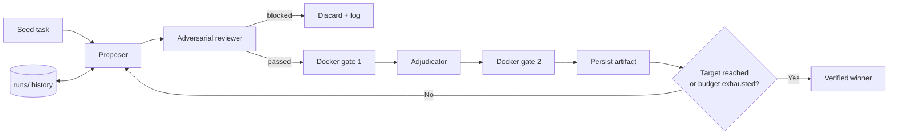

# The adversarial search loop

Minimal Harness extends the Meta-Harness paper's *propose → evaluate → log →
repeat* structure with an adversarial reviewer, an adjudicator, and two
independent Docker gates. Every candidate must survive all four checks before
it can win.

## Stages



| Stage | Role | Prompt file | Failure mode |
|---|---|---|---|
| Proposer | Emit a JSON array of candidate proposals given the seed and prior artifacts. | `meta_harness/prompts/proposer.md` | Malformed output is wrapped as a single raw-text proposal. |
| Reviewer | Adversarially inspect the candidate for correctness, security, testability, and benchmark gaming. | `meta_harness/prompts/reviewer.md` | Invalid review blocks the candidate. |
| Gate 1 | Execute the candidate under a constrained Docker container. | Docker gate abstraction | Non-zero exit or timeout is scored `0.0`. |
| Adjudicator | Pick one first-gate survivor. | `meta_harness/prompts/adjudicator.md` | Invalid selection falls back to deterministic ordering. |
| Gate 2 | Re-run the selected candidate under the same constraints. | Docker gate abstraction | Same as Gate 1. |
| Log | Persist source, review, gate result, and the adjudication outcome for each candidate. | `runs/iteration-N/candidate-ID/candidate.json` | — |

## Why two gates

The paper describes one evaluator outside the proposer. This project runs the
gate twice:

1. **Gate 1** is a coarse filter run on every reviewer-approved candidate.
2. **Gate 2** is a re-run on the adjudicator's single survivor.

The intent is a consistency check: the same candidate should score the same
twice under an identical environment. Divergence between the two runs
indicates nondeterminism in the evaluator or the candidate. In the current
artifact schema both runs are merged into one `dynamic_test` object; a
separate second-gate result field is a natural follow-up so disagreement
becomes queryable.

## Held-out policy

The proposer, reviewer, adjudicator, and any search-time summary must never
receive held-out task results. Held-out evaluation runs after search, in a
separate process, against artifacts written to `runs/`.

## Stopping rule

Search stops when either:

- a candidate reaches the configured `target_score` after Gate 2, **or**
- the configured iteration budget is exhausted.

Every completed iteration writes its full artifact set to `runs/` regardless
of outcome, so a killed run can be inspected and (in future) resumed.

## Artifact layout

Current on-disk layout:

```
runs/
  iteration-1/
    trajectory.jsonl        # one JSON line per model call in the iteration
    candidate-1/
      candidate.json        # id, source, proposal, review, dynamic_test, score
    candidate-2/
      candidate.json
  iteration-2/
    ...
```

`candidate.json` holds the candidate id and source, the proposal string,
the reviewer's structured verdict, the dynamic-test result from the gate
run, and the final score (may be `null` when Docker is disabled).

`trajectory.jsonl` records every model call the iteration made. Each line
carries a UTC timestamp, iteration number, stage (`proposer` / `reviewer` /
`adjudicator`), optional `candidate_id` (present for reviewer calls),
system prompt, user payload, and the raw model response. The file is
append-only within a run.

## Failure modes and defenses

| Failure | Defense |
|---|---|
| Model returns prose instead of JSON | `_json_value` recovers from fenced blocks; falls back to raw-text proposal. |
| Reviewer returns malformed JSON | Candidate is treated as blocked (`passed=False`). |
| Adjudicator returns an invalid selection | Deterministic fallback selects the first Gate 1 survivor. |
| Docker command hangs | Container timeout returns `0.0` and the candidate is discarded. |
| Gate 1 and Gate 2 disagree | Both runs happen; today they collapse into one `dynamic_test` object. Recording the two independently is a follow-up. |
